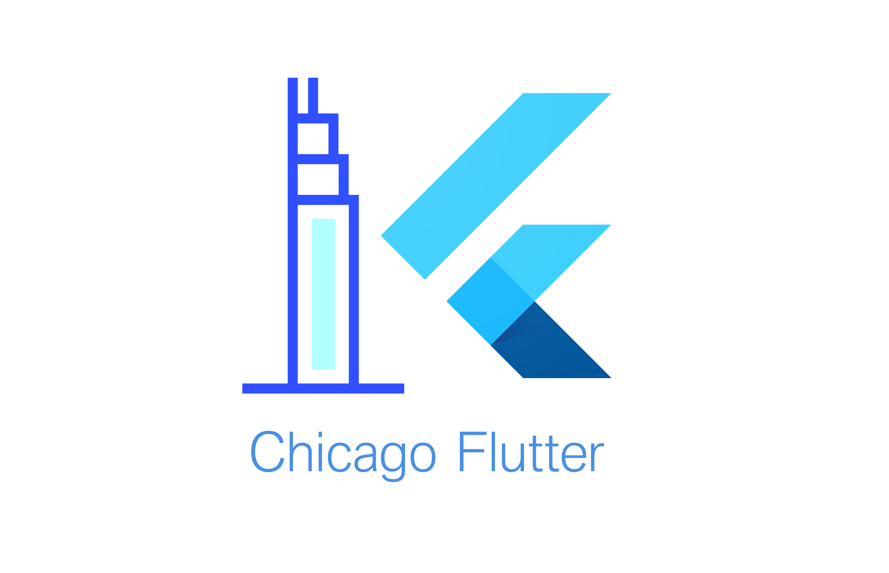

---

# Study Jam #3

## - Wifi: -

### [fit] Conference Room 2nd Flr

---

# Recap of #2

* 29 Attendees
* Covered up to Lesson 2 - Session 9
* Positive feedback on venue, wifi and food

---

# In the last 3 weeks in Chicago...

* [Chicago Flutter @ Github](https://github.com/ChicagoFlutter)
* Multiple articles published on [Flutter Community](https://medium.com/flutter-community)
* [Flutter Live 2018 | Viewing Party - December 4th](https://www.meetup.com/Flutter-Chicago/events/255741357/)
* [Windy City Dev Fest - Feb 1st - $45](https://www.eventbrite.com/e/windy-city-devfest-2019-tickets-49674676294)
* [New Flutter Website!](https://flutter.io)

---

#[fit] We need your
#[fit] Help!

---

# Volunteers

* Spread the word! Twitter and Meetup
* Who is interested in speaking?
* Helping with open source
* Mentoring opportunities & Hackathon

---

#[fit] Let's get started!