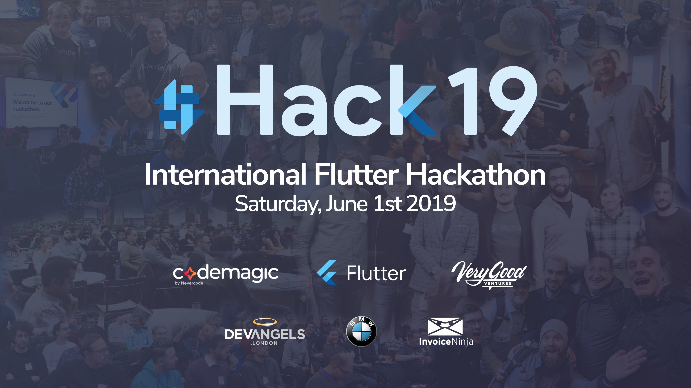
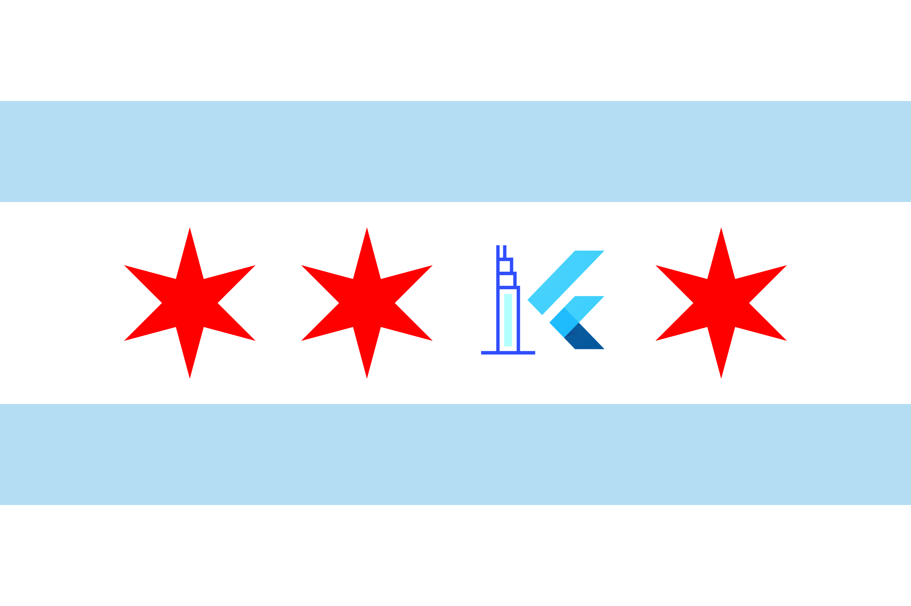
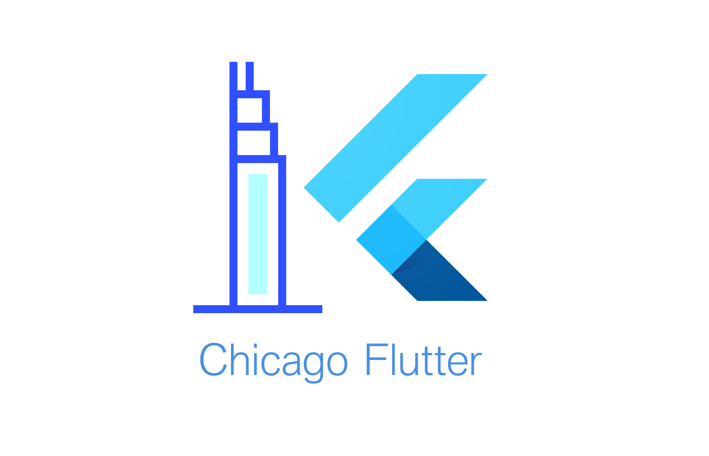

---

# #Hack19 in numbers

- +60 hubs
- +2500 participants registered
- All around the world

---

# Youtube Livestream

- Connecting with all hubs
- Say hi! 👋

---

# Schedule

- 9AM-10AM: Introductions and team forming (2 to 5 people)
- 10AM-11AM: Brainstorming
- 11AM-5PM: Coding
- 5PM-6.30PM: Presentations, voting and wrap up

---

# Wifi & Restrooms

- Conference Room 2nd Floor
- Restrooms passing the elevators

---

# Voting

- 1 winning project in Chicago
- Winning project will be selected to represent the Hub internationally
- Register **now** at [flutterhackathon.com/register](flutterhackathon.com/register)

---

# Voting criteria will be, from most to least important:

- Biggest potential impact on the global Flutter community
- How likely it will be to fully implement and succeed
- Beautiful/innovative design and animations
- Code quality

--- 

# Voting process in Chicago

- Points based system
- Will be done after presentations
- You cannot vote yourself as a team
- Votes will be made public in Github
- I will send the link for international voting later

---

# Voting process for teams

- **3 points** to biggest potential
- **2 points** to possibilities of success
- **1 point** to design and animations

---

# Voting process for Jorge

- **9 points** to biggest potential
- **6 points** to possibilities of success
- **3 point** to design and animations

---

# Rules

- In order to be selected, you must stay until the end
- Project must be related to the theme.
- Code should be hosted in a public repo.
- Project must be completed by the end of your hackathon (local time).

---

# Thank you

---

# ... and the theme is...

---

# [fit] Borders.none()
# [fit] Building a Borderless Global Flutter Community

--- 

# Borders.none()

One of the most amazing things about Flutter is how it has captured the imagination of developers all over the world. No matter what language or level of programming experience, tens of thousands of people have found a home. And they are eager to share and learn. There are now hundreds of local groups across the globe devoted to Flutter. This very hackathon is proof of that, with 70 hubs from 35 countries participating. 

---

# Borders.none()

Your challenge, if you choose to accept it, is to imagine how to strengthen the global Flutter community. How can we better communicate with one another? How can we help each other learn? How can we connect people to opportunities?

---

# Borders.none()

Few ideas:

- Social network
- Chat/Slack alternative
- Job finder
- Mentor matcher

---

# Borders.none()

Few ideas:

- Text translation
- Stack Overflow search
- Code search

---

# [fit] Happy coding!

---

---

