autoscale: true
footer: Chicago Flutter Meetup 09/21/2023
slidenumbers: true

# Shorebird: Code Push for Flutter


### By: Felix Angelov & Kevin Millikin

---

# 👋 Hello

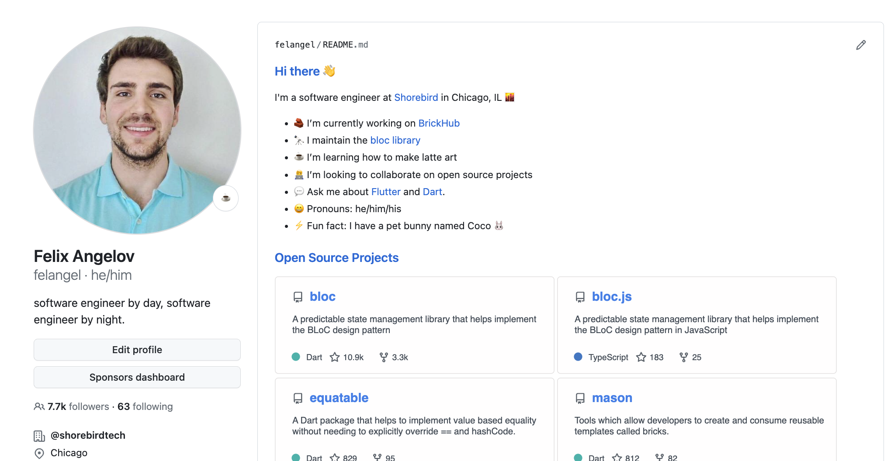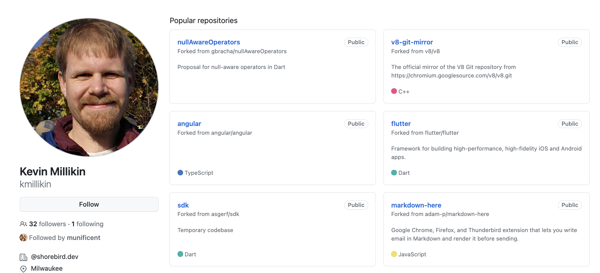

---

# 🦸 Flutter Gives Us Superpowers

- 🎯 Dart
- ⚡️ Hot Reload
- 📱 Mobile (iOS + Android)
- 🖥️ Desktop (MacOS, Linux, Windows)
- 🧩 Declarative UI
- 🔌 Plugins
- 🛠️ Developer Tools

---

# There's only one problem...

# 😅

---

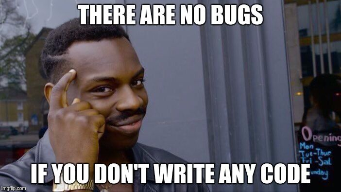

---

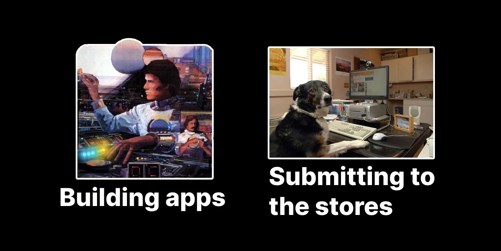

---

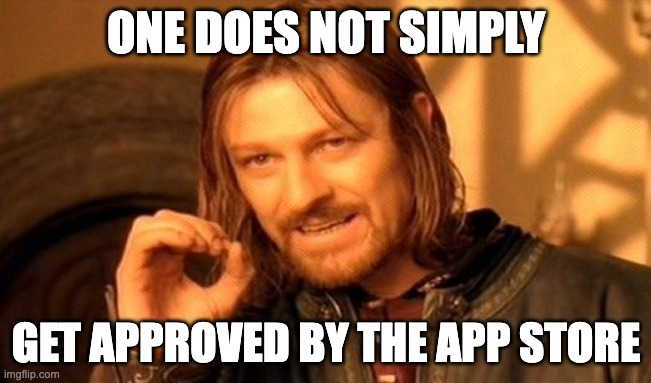

---


---

[.background-color: #1f2023]
[.text: #ffffff]

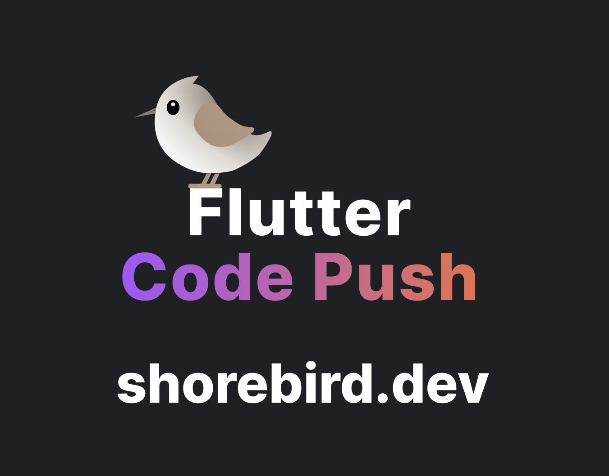

---

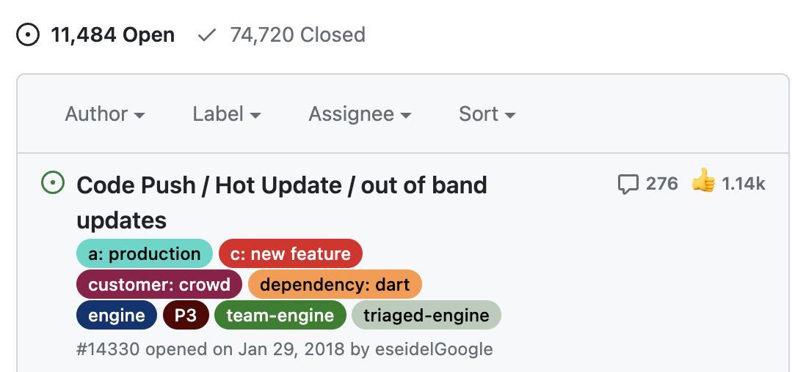

---

# 🐦 Shorebird Code Push

- ⚡️ Hot Restart in Production
- ✨ Change Any Dart Code
- ⏱️ Deliver Over-The-Air Updates Instantly
- 🧵 Seamless Integration
- 💸 Try For Free

Get Started: **https://shorebird.dev**

---


---

# ✨ Demo ✨

---

# 📝 Recap

[.column]

- 🐦 Integrate Shorebird

  - Sign up at https://console.shorebird.dev
  - Install Shorebird CLI
  - Run `shorebird init`

- 📦 Created a Release

  - `shorebird release android`
  - `shorebird release ios-alpha`

- 🧩 Created a Patch

  - `shorebird patch android`
  - `shorebird patch ios-alpha`

[.column]

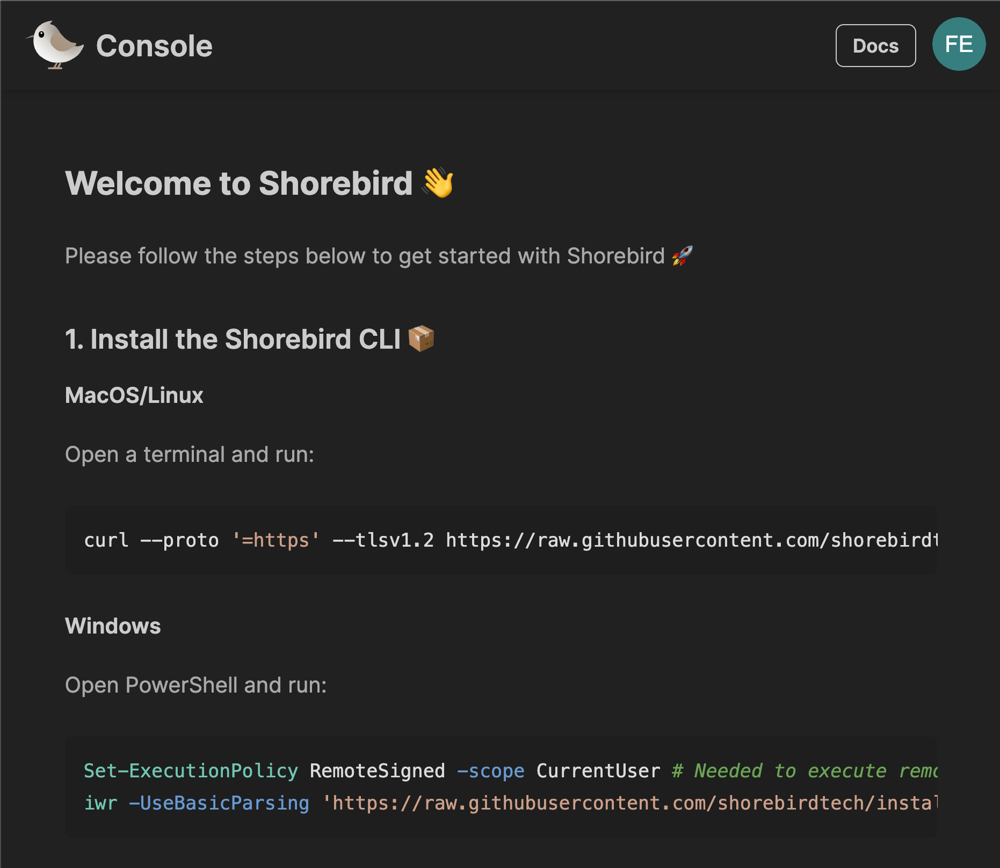

---

# Android & iOS

# 🥳🤖🍎

---

# iOS Code Push

- A technical challenge
- Patched code is not executable
- App Store T&Cs
- Technical barriers in the OS


Shorebird solution: an interpreter to run patched code

---

# Good News / Bad News

- Modify the Dart VM's ARM64 simulator
- The iOS alpha works
- The interpreter is up to 120x slower


We need a mixed CPU/interpreter mode

---

# Challenge #1: It Doesn't Exist

- Normal Dart VM runs all code on the CPU
- Dart VM w/simulator runs
  - C++ on the host CPU (Dart runtime, Flutter, extensions)
  - Dart in the target CPU simulator

---

# Challenge #1: It Doesn't Exist

- Shorebird's modified Dart VM will run in mixed mode
  - host and target are the same
  - C++ and most Dart on the host CPU
  - some Dart on the simulated CPU

---

# FTSE

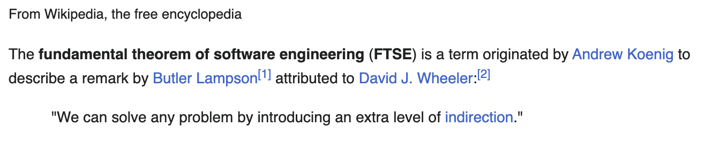

Dart threads have a state bit: currently using CPU or simulator

---

# Challenge #2: *How* to Switch

- A level of indirection at call boundaries
- Choose how to run the called code

We made the code objects themselves "self-transitioning"

---

### Patched Code: CPU to Simulator

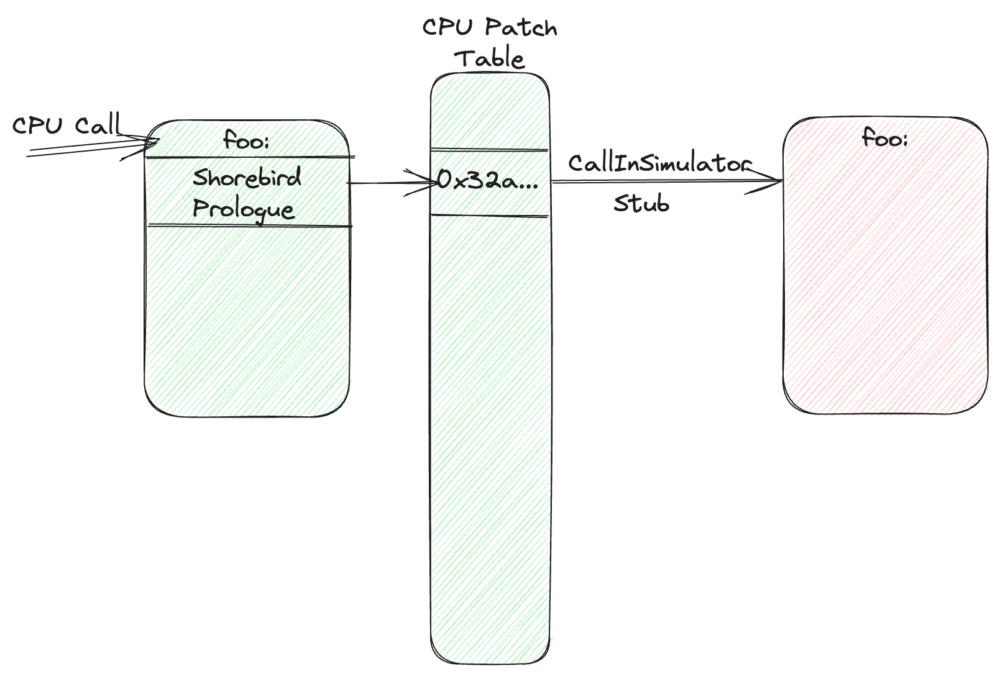

---

### Unpatched Code: Stays on the CPU

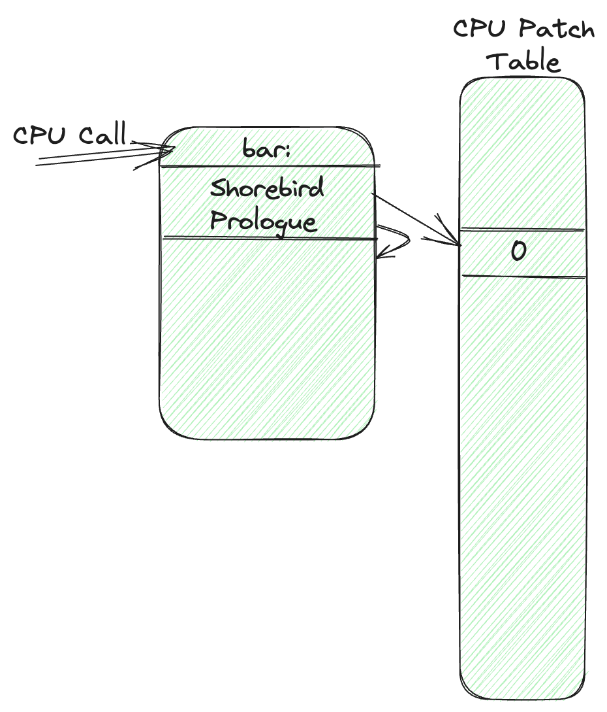

---

### Unpatched Code: Simulator to CPU

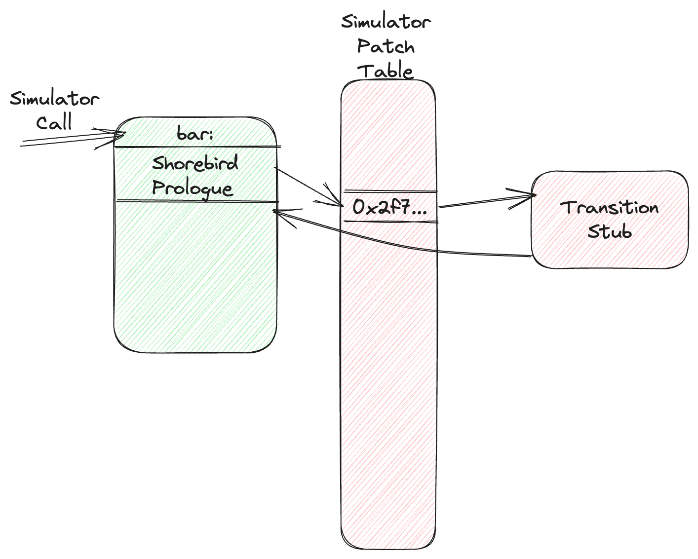

---

### Patched Code: Stays in the Simulator

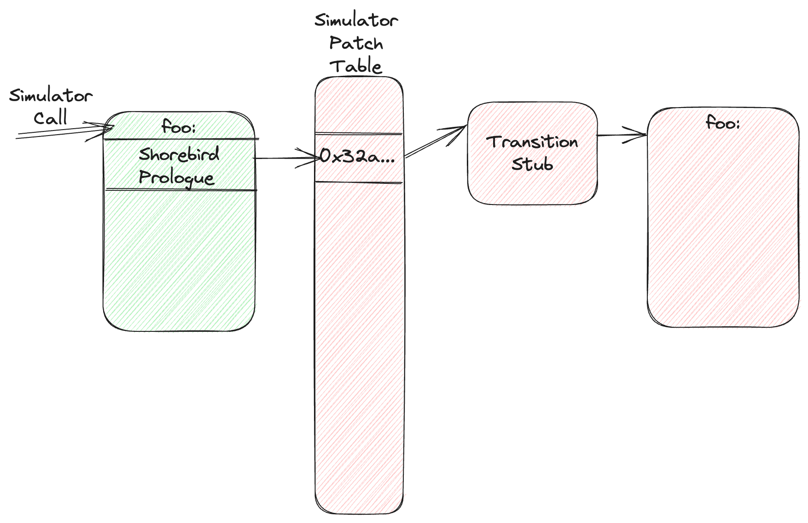

---

# Challenge #3: C++ Code

- Normal Dart VM calls C++ through a stub
- All code runs on the target arch
- Simulator calls an invalid instruction through a stub
- Runs C++ code on the host arch

Neither of these will work for mixed mode

**Solution**: a level of indirection to the stub

---

# Challenge #4: Exception Handling

- Normal Dart VM finds a handler in the stack
- Unwinds down to the handler and runs the handler
- Simulator finds a handler in the stack
- Unwinds *both* stacks and simulates the handler

Mixed mode needs to handle both possibilities

---

# ✨ Highlights

- ✅ Android 🤖
- ☑️ iOS 🍎 (alpha)
- ✅ Flavors 🍧
- ✅ Add-To-App 🧩
- ✅ CI Integration 🚦 (GitHub, Codemagic)
- ✅ Multiple Flutter Versions 🐦
- 🚧 Asset Support 🖼️ (coming soon)

---

# ⚠️ Current Limitations

- 😴 iOS Runs ~100x Slower (100% Interpreted)
- 🎈 iOS Patch Sizes Are Large (No Diffing)
- 📜 Flutter Versions >=3.10.0
- 🐎 Stable Channel Only
- 📱 Mobile Platforms Only

---

# 🤔 How Does Shorebird Work?

- 🏎️ Custom Flutter engine that includes Shorebird updater
- 🎯 Custom Dart compiler + Custom Dart interpreter
- ☁️ Compiled binaries hosted on our servers
  - 🙈 We never see your source code
- 🔌 Optional Dart bindings to interact with the updater
  - `package:shorebird_code_push`

---

# 🍰 Layers

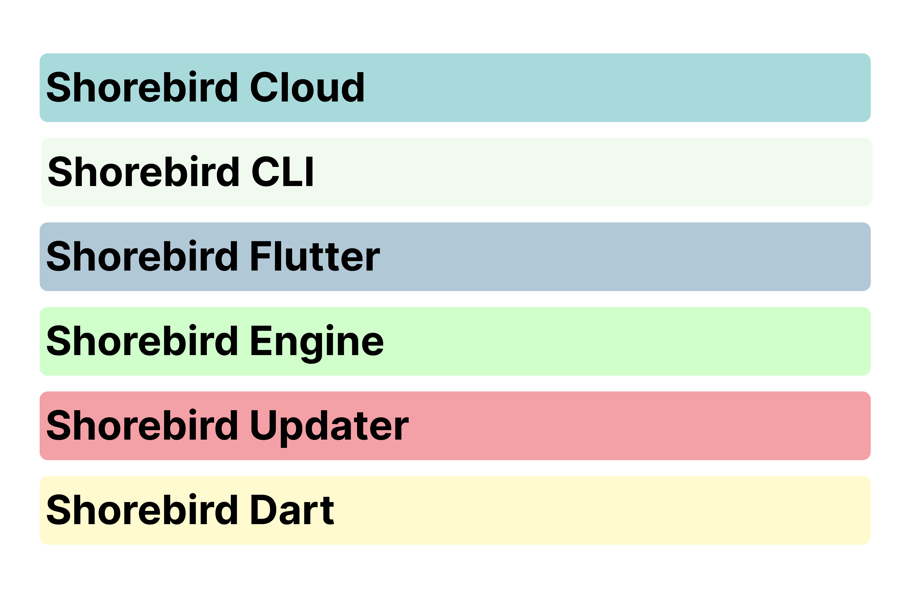

---

# 🫳 Drop-In Replacement

```sh
# Flutter CLI
$ flutter build appbundle --release
$ flutter build ipa --release

# Shorebird CLI
$ shorebird release android
$ shorebird release ios-alpha
```

---

# 🏎️ You Are In Control

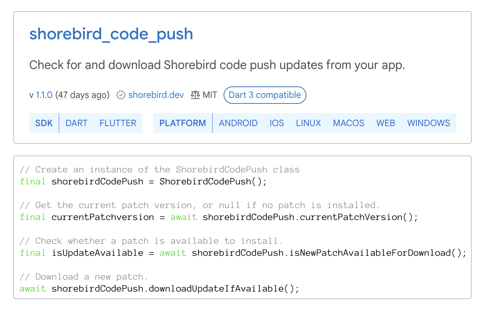

---

# 🚦 Continuous Integration

[.column]

```sh
# Generate a CI Token
$ shorebird login:ci
```

[.column]

```yaml
steps:
  - name: 📚 Git Checkout
    uses: actions/checkout@v3

  - name: 🐦 Setup Shorebird
    uses: shorebirdtech/setup-shorebird@v0
    with:
      flutter-version: 3.13.2

  - name: 🤖 Patch Android
    run: shorebird patch android --force
    env:
      SHOREBIRD_TOKEN: ${{ secrets.SHOREBIRD_TOKEN }}

  - name: 🍎 Patch iOS
    run: shorebird patch ios-alpha --force
    env:
      SHOREBIRD_TOKEN: ${{ secrets.SHOREBIRD_TOKEN }}
```

---

# ✅ Safe For Stores

[.column]
**Play Store**

“An app … may not modify, replace, or update itself using any method other than Google Play's update mechanism.” … “This restriction does not apply to code that runs in a virtual machine or an interpreter”

**Shorebird uses the Dart Virtual Machine. Similar to how other apps use JavaScript or Lua.**

[.column]
**App Store**

3.2.2. “Application may not download or install executable code. Interpreted code may be downloaded…”

**Shorebird uses a custom Dart interpreter on iOS to both comply with store guidelines and provide excellent performance.**

---

[.background-color: #26272b]
[.text: #ffffff]

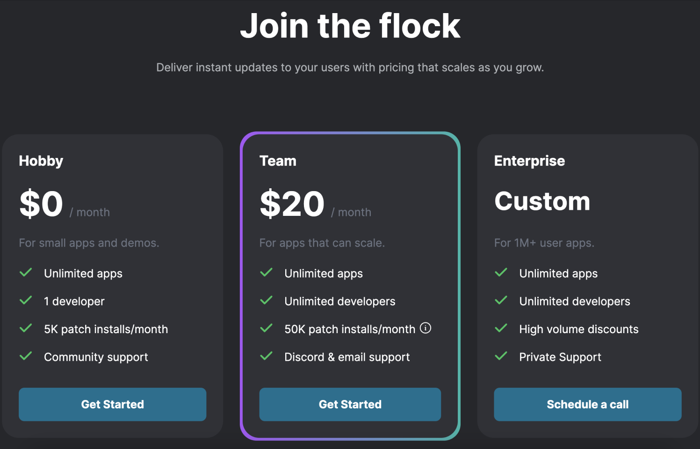

---

# 💬 Chat With Us


**https://discord.gg/shorebird**
**@shorebirddev**

---

# Thank You!

# 💙🙏
